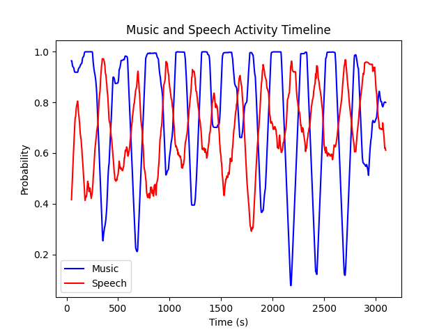

# Speech and music activity detection (SMAD)

This repository contains scripts to detect clean speech from audio files, with no music nor background noise.

## Installation

Install the required dependencies:

```bash
pip install -r requirements.txt
```

## SMAD model inference

In order to detect speech and music in an audio file, we can use [a SMAD model](https://github.com/biboamy/TVSM-dataset#inference-code) trained with TVSM dataset.

The following command will generate a CSV file with the probabilities of speech and music in the audio file:

```bash
python3 inference.py --audio_path ../examples/my_audio_file.mp3 --output_dir output/ --format csv_prob
```

Parameters:
- `--audio_path`: Path to the audio file.
- `--output_dir`: Directory to save the output files.
- `--format`: Format of the output file (csv_prob or csv).

The output will be a CSV file with the following format:

```
start_time_s,end_time_s,music_prob,speech_prob
0.0,0.192,0.9,0.06
0.192,0.384,0.88,0.06
0.384,0.5760000000000001,0.94,0.06
0.5760000000000001,0.768,0.98,0.06
0.768,0.96,0.99,0.04
0.96,1.1520000000000001,1.0,0.04
```

## Plot probabilities

If we want to plot the probabilities of speech and music, we can use the following command:

```bash
python3 plot_activity_timeline.py activity.csv media/example.png
```

The output will be a plot like the following:




## Get filtered segments

If we only want to keep the segments with a high probability of speech, we can use the following command to filter the CSV file:

```bash
python3 get_filtered_segments.py activity.csv activity_no_music.csv --max_gap 0.4 --filter_type speech --speech_min_threshold 0.8 --music_max_threshold 0.05 --min_duration 20
```

Parameters:
- `--max_gap`: Maximum gap between segments to merge them.
- `--filter_type`: Type of activity to filter (speech or music).
- `--speech_min_threshold`: Minimum probability of speech to keep a segment.
- `--music_max_threshold`: Maximum probability of music to keep a segment.
- `--min_duration`: Minimum duration of a segment to keep it.


### Plot filtered segments

Using the same plot command as before, but adding the filtered CSV file as the last argument, we can plot the filtered segments:

```bash
python3 plot_activity_timeline.py activity.csv media/example_speech.png activity_filtered.csv
```

The output will be a plot like the following:


## Remove music segments

If we want to remove the music segments from the audio file, we can use the following command:

```bash
python3 remove_music_segments.py myfile.mp3 myfile_no_music.mp3 activity_no_music.csv --before 0.5 --after 0.5 --min-silence-len 700  --silence-thresh -50
```

Parameters:
- `--before`: Time to keep before the segment.
- `--after`: Time to keep after the segment.
- `--min-silence-len`: Minimum silence length in ms to split the audio file (default 700ms)
- `--silence-threshold`: Silence threshold in dB (default -40dB)


## References

- [Detecting speech and music in audio content (Netflix)](https://netflixtechblog.com/detecting-speech-and-music-in-audio-content-afd64e6a5bf8)
- [A large TV dataset for speech and music activity detection](https://asmp-eurasipjournals.springeropen.com/articles/10.1186/s13636-022-00253-8#Sec25)